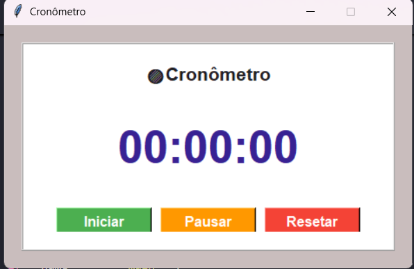

# ⏱️ Cronômetro em Python
 

Um aplicativo de **cronômetro digital simples, intuitivo e moderno** desenvolvido em Python. Este projeto foi criado para praticar conceitos de interfaces gráficas (GUI) e manipulação de tempo/threads em Python.

---

## 🚀 Funcionalidades

O cronômetro conta com três funções principais controladas por botões interativos:

### 1. Iniciar
Dá início à contagem do tempo em formato de horas, minutos, segundos e milissegundos.
 


### 2. Pausar
Congela o tempo atual da contagem, permitindo que o usuário retome do mesmo ponto depois.
 

### 3. Resetar
Zera completamente o temporizador (`00:00:00.00`), limpando a tela para uma nova contagem.
 

---

## 🛠️ Tecnologias Utilizadas

* **[Python](https://python.org)** — Linguagem base do projeto.
* **Tkinter / CustomTkinter** — Para a construção da interface gráfica (interface padrão do Python).
* **Time / Threading** — Para gerenciar a contagem precisa do tempo sem travar a tela.

---

## 📦 Como Executar o Projeto

Certifique-se de ter o Python instalado em sua máquina. Depois, siga os passos abaixo:

1. **Clone o repositório:**
   ```bash
   git clone https://github.com
   ```

2. **Navegue até a pasta do projeto:**
   ```bash
   cd nome-do-repositorio
   ```

3. **Execute o aplicativo:**
   ```bash
   python main.py
   ```

---

## 🤝 Como Contribuir

1. Faça um **Fork** do projeto.
2. Crie uma nova **Branch** para sua funcionalidade (`git checkout -b feature/NovaFuncionalidade`).
3. Salve suas alterações e faça o **Commit** (`git commit -m 'Adiciona nova funcionalidade'`).
4. Envie para o seu repositório original (**Push**) (`git push origin feature/NovaFuncionalidade`).
5. Abra um **Pull Request**.

---

## 📝 Licença

Este projeto está sob a licença MIT. Consulte o arquivo [LICENSE](LICENSE) para mais informações.

---
Feito com ❤️ por [wesley](https://github.com/wesleysilva02)

